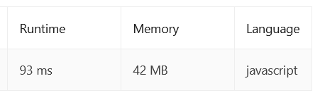
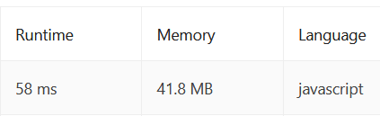

# 374. Guess Number Higher or Lower:

We are playing the Guess Game. The game is as follows:

I pick a number from 1 to n. You have to guess which number I picked.

Every time you guess wrong, I will tell you whether the number I picked is higher or lower than your guess.

You call a pre-defined API int guess(int num), which returns three possible results:

    -1: Your guess is higher than the number I picked (i.e. num > pick).
    1: Your guess is lower than the number I picked (i.e. num < pick).
    0: your guess is equal to the number I picked (i.e. num == pick).

Return the number that I picked.

### Problem [Link](https://leetcode.com/problems/guess-number-higher-or-lower/)

### Submissions:

- [Solution 1](https://github.com/norhan22/problem_solving/blob/f0d44cd333f4ceae5af1ecb6bd44ce1bb1b01c5d/LeetCode/Algo/Binary%20Search/Guess_Number/fun_1.js)

    
  - Optimize Solution 1 to :

```` javascript
  var guessNumber = function(n) {
        let min = 1, max = n
        while (min <= max) {
        const mid = Math.floor((min + max) / 2),  checkGuess=guess(mid)
        if(checkGuess === 0) return  mid
        if(checkGuess === -1) max = mid - 1
        if(checkGuess === 1) min = mid + 1
        }
};

````

 